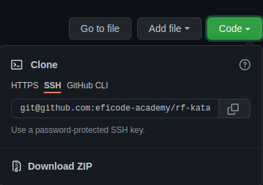

# Getting started

In this section we will install Robot Framework, needed test libraries and ensure that the environment
is up and running in order to do web UI testing with Robot Framework.

## Terminology

In this section, you will see a lot of Python, operating system and Robot Framework related jargon
which might be confusing to some. So before you go further, let's clarify some terminology that is
used frequently in this ecosystem.

- *pip* - Python package manager, this is a tool that is needed to install Robot Framework and needed test libraries
- *shell* - The shell is the command interpreter in an operating system such as Unix or GNU/Linux, it is a program that executes other programs
- *bat / batch file / cmd* - A batch file is a script file in DOS, OS/2 and Microsoft Windows. It consists of a series of commands to be executed by the command-line interpreter, stored in a plain text file.
- *robot* - The command line tool that allows the user to run Robot Framework test cases and tasks
- *test suite* - A Robot file that contains test cases
- *keyword* - a component, similar to a function in programming, that robot uses to execute steps
- *arguments* - Values that are given to keywords. Also known as parameters.

## Get the Repository

Clone the repository or download and extract the repository ZIP to your local machine. All exercises will be completed using the
local copy of the repo.

## Install Robot Framework

In order to run Robot Framework test cases we're going to need install Robot Framework. We install this by
using `pip`. By default, the installation happens by calling `pip3 install <package_name>`, but if you are
using a virtual environment, or have an alias defined, you can try `pip install <package_name>` instead.

Install Robot Framework: `pip3 install robotframework`.

If the installation was successful, you can use `robot -h` command to verify that you get command line
help for Robot Framework. Output should include Robot version number and some other helpful stuff,
including the command line options (which are also available in [here](http://robotframework.org/robotframework/latest/RobotFrameworkUserGuide.html#all-command-line-options)).

To run automated test cases for web UIs, the current go-to library is the Browser-library.

Install Browser: `pip3 install robotframework-browser`. After the installation has completed successfully,
the library has to be initialized by running `rfbrowser init`.

In order to ensure that you've done exercises as expected we need you to install robotframework-lint
tool. A linting tool is a lightweight static analysis tool to verify that you and your team are doing
your code consistently.

Install Robot Framework linter: `pip3 install robotframework-lint`.

## Install NodeJS

Browser library has requirements for NodeJS. After installing NodeJS run command: `rfbrowser init` to install needed dependencies.

## Start server

In order to run the exercises in this training, you need to start the demo app. You can start the server
by running `python3 server/server.py` in your terminal/command prompt. Your terminal or command prompt is
now occupied with running the server, which means you need to open another terminal/command prompt to run
your tests.

After the server has started it will be running in http://localhost:7272.

## Verify installation

Verify setup by running:

- in Windows: run command `python verify.py 00`
- in macOS/Linux: run command `python3 verify.py 00`

This should take a few seconds. If the output of the script ends with `Setup in perfect condition!`
we're good to go.

Otherwise, check the output and fix the missing packages.
